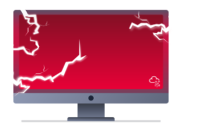
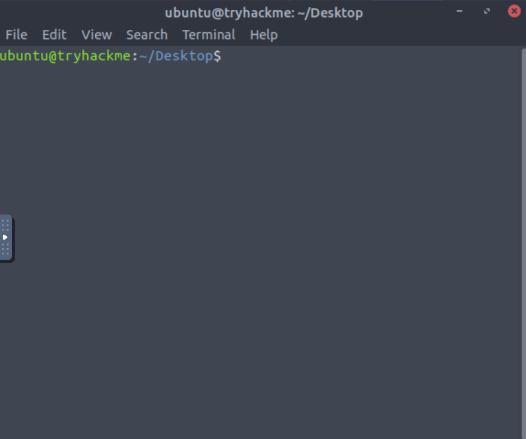
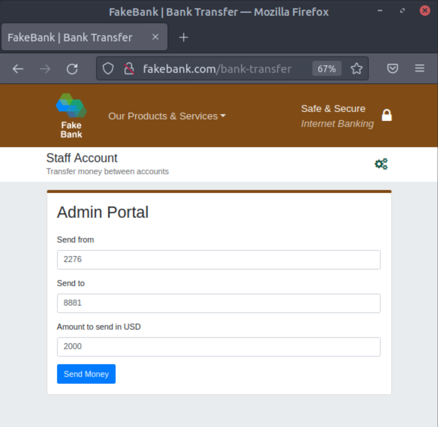

## TASK 1 - What is Offensive Security?


TIP: Try to understand concepts deeply before referring to the answer

Offensive security/Red team



All of this is about simulating the action of a malicious hacker and reporting them before the actual hacker is able to exploit the vulnerabilities the ethical hacker found.

What do they hackers hack?
- Web applications (Websites)
- Infrastructure (Computers,Phones,IOT Devices)
- Cloud
- Networks
- Budlings and People (Testing an organizations security by breaking in and tricking people through social engineering)

Under offensive security there are 2 main branches:
***Penetration Testing*** and ***Red Teaming***.

 ***Pentesting*** involves hacking within set a scope the organization wants you to abide by when you are hacking which could be any of the systems mentioned above although its mainly Web applications, Infrastructure and cloud

  ***Red*** Teaming on the other hand is simulated full on attack with no restrictions what so ever ussualy including the buiding itself, systems listed above and even the employees

Check these videos out to get an idea .

***Red Teaming***
[Watch the video on YouTube](https://www.youtube.com/watch?v=pL9q2lOZ1Fw&ab_channel=InsiderTech)

***Pentesting***
[Watch the video on YouTube](https://www.youtube.com/watch?v=_NVxgQdA45g&ab_channel=careersnz)


On the other hand, defensive security is about protecting computer systems and networks from attacks. This involves looking for any signs of hacking, figuring out how it happened if something was breached, and keeping an eye on everything to spot any malicious activity. It's like being a digital detective and security guard all rolled into one.

***QUESTION***: Which of the following options better represents the process where you simulate a hacker's actions to find vulnerabilities in a system?

* Offensive Security
* Defensive Security

<br>
<br>
<br>


***ANSWER***:
 Offensive Security

## TASK 2 - Hacking your first machine

<br>

Step 1 Click on the terminal icon

What is Terminal?<br>
The terminal, also known as the command line or command prompt(CLI), is a text-based interface used to interact with a computer's operating system. Imagine it as a conversation between you and your computer, where instead of clicking on icons or menus, you type out commands. Here's an image:




What is GUI?
<br> A GUI, or Graphical User Interface on the other hand is like the "face" of your computer that you interact with using visual elements rather than text commands. It's what you see on the screen, including windows, icons, buttons, and menus, which you can click on to perform various tasks. Here's an Image:


<br>
<br>
<br>
<br>


Step 2 Using Gobuster

The tool used in this task is called Gobuster which is a tool to find hidden parts of a website(known as directories) or servers that aren't meant to be easily found. Think of it like a digital treasure hunt where you're trying to discover secret doors and hidden rooms in a building.


Use this  command: <br>`gobuster -u  http://fakebank.com -w wordlist.txt dir` scans the specified website (http://fakebank.com) for hidden directories(a folder) and files listed in wordlist.txt. It identifies which of these directories and files exist on the server by sending HTTP requests and checking the server's responses. As you can see in the image below the 2 site locations  that are regular user will not see are :

1. `/images`
2. `/bank-transfer`

```
ubuntu@tryhackme:~/Desktop$ gobuster -u http://fakebank.com -w wordlist.txt dir

=====================================================
Gobuster v2.0.1              OJ Reeves (@TheColonial)
=====================================================
[+] Mode         : dir
[+] Url/Domain   : http://fakebank.com/
[+] Threads      : 10
[+] Wordlist     : wordlist.txt
[+] Status codes : 200,204,301,302,307,403
[+] Timeout      : 10s
=====================================================
2024/06/20 12:38:08 Starting gobuster
=====================================================
/images (Status: 301)
/bank-transfer (Status: 200)
=====================================================
2024/06/20 12:38:16 Finished
=====================================================

```
Now that we've got the path that allows us to send money key in the path search
add the path to fakebank like in the screen shot . When you find it and type in the account number and 2000$


Click on send money and you should see this message:


<br>


Return by clicking on Fakebank icon or going back.

Thats it!🎉


## TASK 3 - Hacking your first machine
Read up on the role descriptions, those are the main offensive roles


This room  "explores offensive and defensive security concepts. Offensive security involves simulating hacker actions to identify system vulnerabilities before real attacks occur, while defensive security focuses on protecting systems and detecting breaches.  Gobuster is used for finding hidden website directories, showcasing CLI (Command Line Interface) and GUI (Graphical User Interface) differences. It provides practical steps, such as using Gobuster to scan a website for hidden directories and executing simulated transactions through a GUI interface.

That's this room done.
Doing a few  minutes or an hour a day will accumalte over time if you keep at it.
All the best 🙌
